## Course Logistic

* Every Wednesday 19:00 - 21:00
* Slides: http://nikolaypavlov.github.io/da-workshops-4/
* Skype Chat: https://join.skype.com/gjN0CfAd4bhg
* Reference Book: https://www.openintro.org/stat/textbook.php
* help(Distributions)
* Install the following packages: openintro, ggplot2

---
## Topics

* Complete probability space, PMF
* Expected value, variance
* Linear Combinations of random variables
* Contineous case, PDF
* Normal Distribution, Z-score, CDF
* Bernulli distribution
* Geometric distribution
* Binomial distribution

---
## Complete probability space

$\Omega = \{w_1, \dotsc, w_n\}$ - sample space, $w_i$ - elementary sample

$P(w_1) = p_1, \dotsc, P(w_n) = p_n$, where $p \in [0,1]$

$p_1 +, \dotsc, + p_n = 1$ or $P(\Omega) = 1$

$A \subseteq \Omega, P(A) = \sum_{w_i \in A}p_i$

All classical probability properties remains valid

---
## Random Variable, Distribution

Let's say we have $\Omega, P$, than random variable is any function $\xi: \Omega \to \mathbb{R}$

$\xi: \Omega \to \{y_1, \dotsc, y_k\}, \Omega = \{w_1, \dotsc, w_n\}$

Distribution of random variable $\xi$: $P(\xi = y_i) = P({w_i: \xi(w_i) = y_i})$ - Probability Mass Function (PMF)


---
## Example 

Two books are assigned for a statistics class: a textbook and its corresponding study guide. The university bookstore determined 20% of enrolled students do not buy either book, 55% buy the textbook only, and 25% buy both books. The textbook costs \\$137 and the study guide \\$33.

If random variable X is the amount of money a single student will spend on books, the distribution of X:

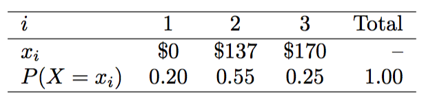


---
## Expected Value of a Discrete Random Variable

$E(\xi) = \mu = \sum_{w \in \Omega}\xi(w)P(w) = \sum_{j=1}^{k}y_j P(\xi = y_j)$ 


```r
data <- data.frame(cost=c(0, 137, 170), prob=c(0.2, 0.55, 0.25))
ex <- sum(data$cost * data$prob)  # Expected value
p <- ggplot(data, aes(cost, prob)) + geom_bar(stat="identity") + xlab("Cost") + ylab("Probability") + ggtitle("Probability distribution for the bookstore’s revenue from a single student")
p <- p + geom_hline(yintercept=0, size=1, color="black") 
p <- p + geom_vline(xintercept=ex, linetype="dashed", colour="red", size=1)
p
```

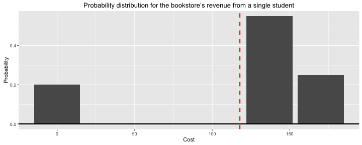

---
## Variance, Linear Combinations

$Var(\xi) = \sigma^2 = E[(\xi - E(\xi))^2]$

### Linear combinations of random variables

$X,Y$ - are random variables

$E(aX + bY) = a E(X) + b E(Y)$

$Var(a X + b Y) = a^2 Var(X) + b^2 Var(Y)$

Leonard has invested \\$6000 in Google and \\$2000 in Exxon Mobil. If X and Y represents the change in Google’s and Exxon's stock next month. Suppose they have recently been rising 2.1% and 0.4% per month, respectively. Compute the expected change in Leonard’s stock portfolio for next month.

$E(6000 * X + 2000 * Y) = 6000 * 0.021 + 2000 * 0.004 = 134$

Let's say $V(X) = 0.0072$ and $Var(Y) = 0.0027$. Compute the variance of Leonard’s monthly return.

---
## Contineous case, PDF


```r
hist(email$num_char, seq(0, 195.0, by=5), probability=T, xlab="Number of characters (in thousands)", 
     ylab="", main="Probability Density Function")
lines(density(email$num_char), col="red", lwd=3)
```

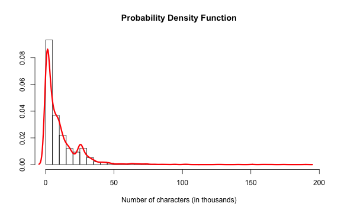

A random variable $X$ has density $f_X$, if: $P[a \leq X \leq b] = \int_{a}^{b} f_X(x) dx$

---
## Normal Distribution

Video

---
## Normal Distribution

$N(x|\mu,\sigma) = \frac{1}{\sigma\sqrt{2\pi}} e^{\frac{-(x - \mu)^2}{2\sigma^2}}$


```r
x <- seq(-5, 5, length=100) 
sx <- dnorm(x, mean=0, sd=1)
hx <- dnorm(x, mean=0, sd=2)
plot(x, sx, type="l", lwd=3, col="darkblue", ylab="", main="Normal Distribution")
lines(x, hx, type="l", lwd=3, col="darkgreen")
```

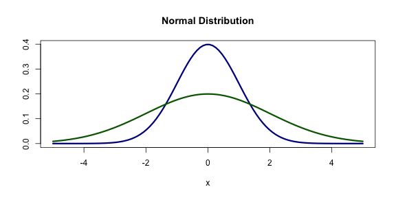

---
## Z-score $ = \frac{x - \mu}{\sigma}$


Head lengths of brushtail possums follow a nearly normal distribution with mean 92.6 mm and standard deviation 3.6 mm. Compute the Z-scores for possums with head lengths of 95.4 mm and 85.8 mm. Which observation is more unusual?

First: $(95.4 - 92.6) / 3.6 = 0.78$     Second: $(85.8 - 92.6) / 3.6 = -1.89$

---
## How unusual are they? Percentile.


```r
c(pnorm(0.78), pnorm(-1.89))
```

```
## [1] 0.78230456 0.02937898
```


```r
cord.x <- c(77, seq(77, 95.4, 0.01), 95.4)
cord.y <- c(0, dnorm(seq(77, 95.4, 0.01), mean=92.6, sd=3.6), 0)
curve(dnorm(x, 92.6, 3.6), from=77, to=107, lwd=2, xlab="Length (mm)", main="Possum head length distribution", ylab="")
polygon(cord.x, cord.y, col='skyblue')
```

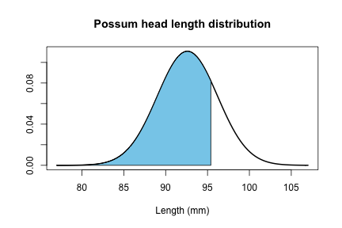

---
## Cumulative distribution function (CDF)

$f_X(x) = P(X \leq x)$


```r
curve(pnorm(x, 92.6, 3.6), from=77, to=107, lwd=2, xlab="Length (mm)", main="Possum head length distribution", ylab="")
abline(v=95.4, col="darkblue", lty=2, lwd=3)
abline(v=85.8, col="darkgreen", lty=2, lwd=3)
legend("bottomright", c("95.4mm head", "85.8mm head"), col=c("darkblue", "darkgreen"), lty=2)
```

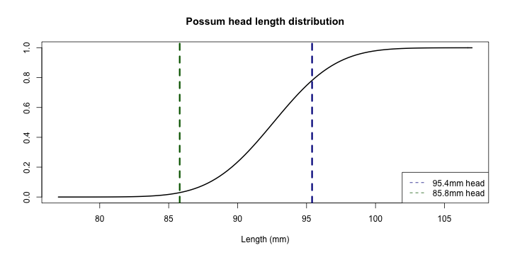

---
## Exercise

1. What is the probability that possum has at least 98 mm head?


2. Possum has 91.5 mm head. What is his percentile? What percent of possums has longer heads?


3. What is the possum head length at the 55th percentile? See help for *norm family functions


4. What is the probability that a random possum head is between 93 mm and 94 mm?


---
## 68-95-99.7 rule

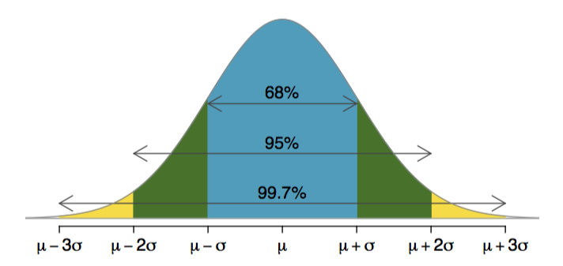

---
## Quantile-Quantile plot


```r
x1 <- rnorm(40); x2 <- rnorm(100); x3 <- rnorm(1000)
par(mfrow=c(1,3))
qqnorm(x1); qqline(x1)
qqnorm(x2); qqline(x2)
qqnorm(x3); qqline(x3)
```

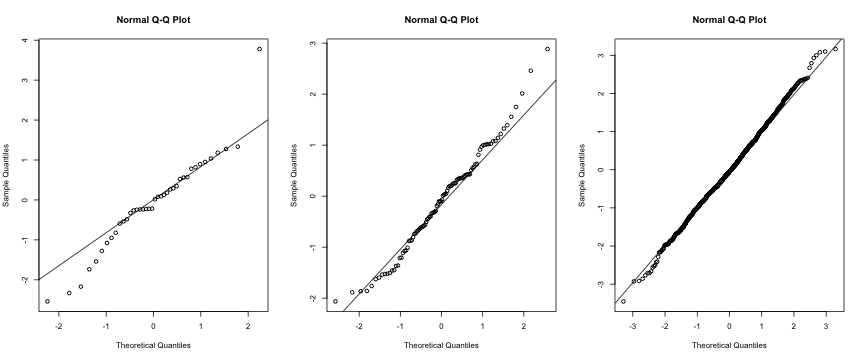

---
## Bernulli distribution

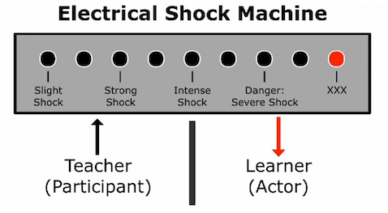

$p = 0.35, (1-p) = 0.65$

$\mu = E(X) = P(X=0) * 0 + P(X=1) * 1 = (1 - p) * 0 + p * 1 = p$

$\sigma^2 = E[(X - E(X))^2] = P(X=0)(0-p)^2 + P(X=1)(1-p)^2 = \\ = (1-p)p^2 + p(1-p)^2 = p(1-p)$

---
## Geometric distribution, iid

What are the chances that experimentator will stop the study after the first person? The second person? The third? nth person?

$P(First) = 0.35, P(Second) = (0.65) (0.35) = 0.228, P(Third) = (0.65)(0.65)(0.35) = 0.148$ 

$P(n^{th} person) = (0.65)^{n-1}(0.35) = (1-0.35)^{n-1}(0.35) = (1-p)^{n-1}p$

$\mu = \frac{1}{p},  \sigma^2 = \frac{1-p}{p^2}$ 


```r
barplot(dgeom(0:10, prob=0.35), main="Geometric distribution, p = 0.35", ylab="Probability", xlab="Trials")
```

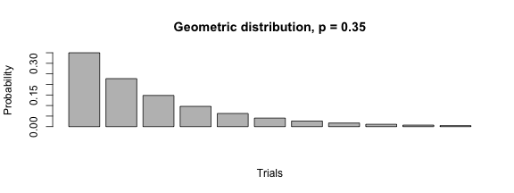

---
## Binomial distribution

Suppose we randomly selected four individuals to participate in the Milgram's study. What is the chance exactly one of them will be a success?

Let’s consider a scenario where one person refuses:

$P(A=1, B=0, C=0, D=0) = (0.35)(0.65)(0.65)(0.65) = (0.35)^1 (0.65)^3 = 0.096$

[# of scenarios] x P(single scenario) $= 4 * (0.35)^1 (0.65)^3 = 0.38$

### For k success in n trials 

P(single scenario) $= p^k(1-p)^n-k$

[# of scenarios] $= {n \choose k} = \frac{n!}{k!(n-k)!}$

${n \choose k}p^k(1-p)^{n-k}$

$\mu = np, \sigma^2 = np(1-p)$

--- 
## Binomial distribution


```r
barplot(dbinom(0:5, size=5, prob=0.35), main="Binomial distribution, n = 5, p = 0.35", ylab="Probability", xlab="Number of successful trials")
```

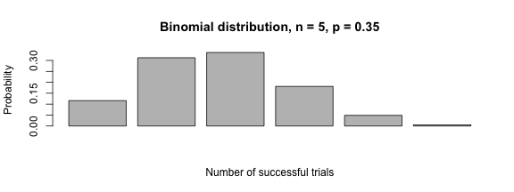

### Is it binomial?

1. The trials are independent. 
2. The probability of a success, p, is the same for each trial.
3. The number of trials, n, is fixed.
4. Each trial outcome can be classified as a success or failure

---
## What if we increase the number of trials to 10?


```r
barplot(dbinom(1:10, size=10, prob=0.35), main="Binomial distribution, n = 10, p = 0.35", ylab="Probability", xlab="Number of successful trials")
```

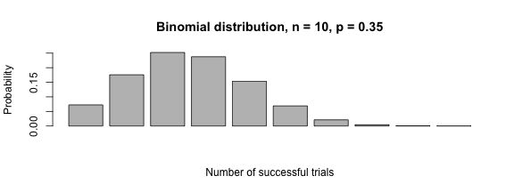

---
## What if we increase the number of trials to 60?


```r
barplot(dbinom(1:100, size=100, prob=0.35), main="Binomial distribution, n = 60, p = 0.35", ylab="Probability", xlab="Number of successful trials")
```

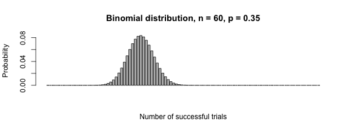

---
## Exercise


1.  If you ran a Milgram's study. What is the chance that you will find the first success within the first 5 people?


2. If you randomly sampled 40 persons, how many would you expect to refuse to administer the worst shock? What is the standard deviation of the number of people who would refuse?


```r
count <- 40 * 0.35
std <- sqrt(count * 0.65)
```

3. Approximately 20% of the US population smokes cigarettes. A local government believed their community had a lower smoker rate and commissioned a survey of 400 randomly selected individuals. The survey found that only 59 of the 400 participants smoke cigarettes. If the true proportion of smokers in the community was really 20%, what is the probability of observing 59 or fewer smokers in a sample of 400 people?


```r
smokers <- sum(dbinom(0:59, size=400, prob=0.2))
```

---
## Homework

* [Lab 3 - Probability](http://htmlpreview.github.io/?https://github.com/andrewpbray/oiLabs-base-R/blob/master/normal_distribution/normal_distribution.html
* Skype Chat for discussions: https://join.skype.com/gjN0CfAd4bhg
* Reading: OpenIntro Statistics Chapter 2,3, from p. 2.4 till the end
* Reference Book: https://www.openintro.org/stat/textbook.php
* help(Distributions)
